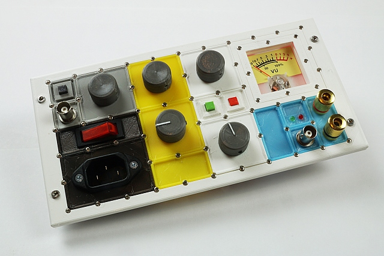

Maker Media GmbH

***

# Frontplatten mit System

**Ein Mosaiksystem ist eine modulare Lösung für Frontplatten von Selbstbaugeräten und Prototypen. Mit OpenSCAD geplant und parametriert, sind die Frontplatten extrem flexibel einsetzbar.**

 

Den vollständigen Artikel gibt es in der [Make 3/24 ab Seite 16]().

Hier finden Sie die OpenSCAD-Quellen und weitere Informationen zum Artikel.
